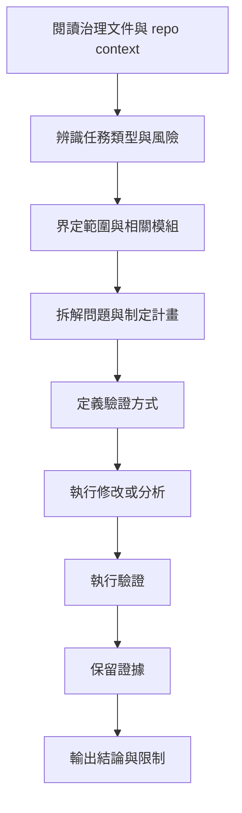

# AGENTS.md

## 1. 文件定位

本文是本 repo 中 AI agent 的 **入口規則文件**。

其目的不是承載所有細節，而是作為 AI 進入本 repo 後的第一個工作入口，明確告知：

* 應先閱讀哪些文件
* 在本 repo 中應如何展開工作
* 哪些規則不可違反
* build、test、lint、run 等工程入口在哪裡
* 哪些類型的修改屬於高風險或禁止事項

本文應與以下文件配合使用：

* `ai/governance/workflow-invariants.md`
* `ai/governance/engineering-principles.md`
* `ai/governance/evidence-policy.md`
* `docs/ai/repo-context.md`
* 各類 stack-specific / path-specific instruction 文件
* 各類 task template

---

## 2. AI 在本 repo 中的基本角色

在本 repo 中，AI 的角色是：

> 受治理約束的工程協作代理。

AI 不應被視為可自由決策、可繞過工程規範的特殊角色。

AI 的所有產出都必須接受：

* 架構邊界約束
* 測試與驗證要求
* review 與追溯要求
* 完成宣稱限制

AI 不得因為產出速度快而跳過既有工程治理。

---

## 3. 必讀文件順序

AI 進入本 repo 後，應依以下順序建立上下文。

### 第一層：共通治理文件

先閱讀：

1. `ai/governance/workflow-invariants.md`
2. `ai/governance/engineering-principles.md`
3. `ai/governance/evidence-policy.md`

目的：

* 確立共通工作流程
* 確立工程判準
* 確立證據與完成宣稱規則

### 第二層：本 repo 文件

再閱讀：

4. `docs/ai/repo-context.md`

目的：

* 理解本 repo 的責任邊界
* 理解本 repo 的模組切分
* 理解本 repo 的 build/test/run 入口
* 理解本 repo 的主要風險與禁止事項

### 第三層：stack-specific / path-specific 文件

依本次任務涉及的技術棧或目錄，再閱讀對應 instruction，例如：

* `docs/ai/stack/springboot-entrypoints.instructions.md`
* `docs/ai/stack/springboot-service.instructions.md`
* `docs/ai/stack/springboot-domain.instructions.md`
* `docs/ai/stack/grails-entrypoints.instructions.md`
* `docs/ai/stack/python-flask-entrypoints.instructions.md`
* 其他對應文件

### 第四層：任務模板

若本次任務有指定 task template，應再套用：

* `ai/tasks/implement-feature.md`
* `ai/tasks/fix-bug.md`
* `ai/tasks/safe-refactor.md`
* `ai/tasks/ops-diagnose.md`
* 其他對應模板

---

## 4. 本 repo 的標準工作方式

AI 在本 repo 中工作時，必須遵守以下基本流程。

### 最低要求

* 不得在未建立上下文前直接大幅修改
* 不得在未界定範圍前跨模組擴張變更
* 不得在未定義驗證方式前宣稱任務可完成
* 不得在未保留證據前宣稱已完成

---

## 5. 本 repo 中一律適用的核心要求

### 5.1 先分析，再修改

對於非極小型、無歧義、低風險修改，必須先：

* 理解任務
* 確認涉及區域
* 確認風險
* 確認驗證方式

### 5.2 先定義驗證，再實作

在本 repo 中，AI 不得先大幅修改後才回頭思考如何驗證。

至少應先確認：

* 哪些指令可用於 build / test / run
* 哪些行為需要驗證
* 哪些部分可能無法完整驗證

### 5.3 採取最小修改原則

修改應盡量與任務直接對應。

若需要額外整理、延伸重構或調整相鄰模組，必須：

* 顯式說明原因
* 顯式說明影響範圍
* 顯式說明風險

### 5.4 不得以猜測取代 source 驗證

在本 repo 中，AI 不得：

* 憑印象假設 type、enum、field
* 憑印象假設分層責任
* 憑印象假設某模組用途
* 憑印象假設某流程已存在或不存在

所有具體判斷，應以 source、設定、文件或明確 evidence 為準。

### 5.5 無法驗證不得宣稱完成

在本 repo 中，所有完成宣稱都必須符合 `ai/governance/evidence-policy.md`。

若尚未執行對應驗證，應明確表述為：

* 已完成分析
* 已完成草案
* 已完成部分實作
* 已完成初步修正，但尚未驗證

不得描述成：

* 已全部完成
* 已修正完成
* 已可直接上線

除非有足夠證據支撐。

---

## 6. Build / Test / Run / Lint 入口

本節應由 `docs/ai/repo-context.md` 提供具體內容。

在 `repo-context.md` 尚未建立前，AI 應自行先辨識本 repo 的以下工程入口，並在任務中明確使用：

* build 指令
* compile 指令
* test 指令
* lint / static analysis 指令
* 本地 run 指令
* 必要環境變數或 profile

### 原則

* 不得在未知工程入口的情況下直接宣稱修改可運作
* 不得只做靜態修改就宣稱整體行為正確
* 不得省略對 build/test 可行性的說明

---

## 7. 完成輸出最低要求

AI 在本 repo 中完成任務後，至少應輸出以下內容。

### 7.1 修改摘要

* 做了哪些修改
* 修改在哪些區域
* 為何這樣修改

### 7.2 驗證摘要

* 已執行哪些驗證
* 驗證結果如何
* 尚未執行哪些驗證

### 7.3 風險與限制

* 目前尚未覆蓋的範圍
* 可能仍存在的風險
* 需要人工進一步確認的事項

### 7.4 證據

* test / build / command output
* log / response / report
* 其他可追溯 evidence

---

## 8. 高風險修改行為

以下類型的修改，應視為高風險，必須更嚴格控制。

### 8.1 跨層修改

例如：

* 同時變更 entrypoint、service、domain、repository
* 同時變更 UI、API、資料模型、流程編排

### 8.2 架構邊界調整

例如：

* 新增跨模組依賴
* 更動層級責任
* 將邏輯移入原本不該承接的層

### 8.3 對外契約變更

例如：

* API request / response 結構變更
* event payload 變更
* DB schema 或資料格式變更
* SOAP / REST contract 變更

### 8.4 高影響維運操作

例如：

* deployment 設定修改
* 環境變數調整
* 資料轉換或批次流程改動
* 會影響多個模組的配置修改

### 高風險修改額外要求

遇到上述情況，AI 應額外輸出：

* 影響範圍
* 風險說明
* 驗證策略
* 尚未驗證部分

---

## 9. 禁止事項

在本 repo 中，AI 不得從事以下行為。

### 9.1 未閱讀必要上下文即大幅修改

### 9.2 未定義驗證方式即宣稱需求可完成

### 9.3 以猜測取代 source 驗證

### 9.4 借修 bug 之名擴張未說明重構

### 9.5 修改與任務無關的區域而未揭露

### 9.6 用語氣代替證據

### 9.7 將靜態分析表述成已驗證事實

### 9.8 未執行測試或驗證即宣稱完成

### 9.9 破壞既有架構邊界以求快速完成

### 9.10 將未覆蓋風險隱藏不報

---

## 10. 建議的任務對接方式

本 repo 中常見任務，建議優先對接以下模板。

| 任務類型   | 建議模板                            |
| ------ | ------------------------------- |
| 新功能開發  | `ai/tasks/implement-feature.md` |
| Bug 修正 | `ai/tasks/fix-bug.md`           |
| 安全重構   | `ai/tasks/safe-refactor.md`     |
| 維運排障   | `ai/tasks/ops-diagnose.md`      |
| 報告整理   | `ai/tasks/generate-report.md`   |

若模板尚未建立，至少也應遵守本文與三份 governance 文件。

---

## 11. 與下層文件的分工

為避免本文件膨脹，以下內容應交由其他文件承擔：

### 由 `docs/ai/repo-context.md` 承擔

* repo 目的與責任邊界
* 模組說明
* build/test/run 指令
* 實際環境與開發前提
* repo 專屬風險

### 由 stack-specific 文件承擔

* 某 framework 的分層責任
* 某 path 的實作限制
* 某技術棧的測試與驗證細節

### 由 task template 承擔

* 單次任務的輸出格式
* 單次任務的步驟模板
* 單次任務的 evidence 段落格式

---

## 12. 最小可行版本要求

若本 repo 目前 AI 文件尚未齊備，至少應要求 AI：

1. 先閱讀三份 governance 文件
2. 先辨識本 repo 的 build/test/run 入口
3. 先界定修改範圍與風險
4. 先定義驗證方式再實作
5. 只做最小必要修改
6. 保留證據並揭露未驗證範圍
7. 無法驗證不得宣稱完成

---

## 13. 一句話總結

> `AGENTS.md` 的角色，是作為 AI 進入本 repo 後的入口規則文件：先把 AI 連接到共通治理原則，再導向 repo context、stack 規則與任務模板，並在一開始就固定最基本的工作方式、禁止事項、驗證要求與完成宣稱邊界。
