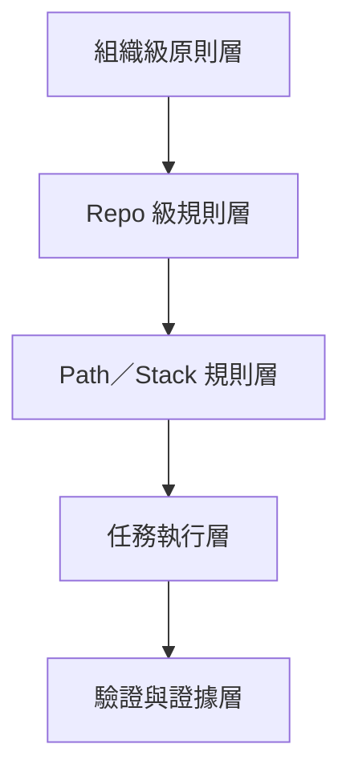
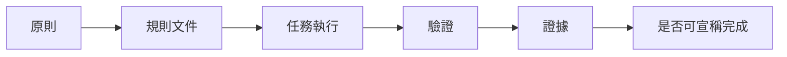

# AI-instruction-規劃藍圖

## 1. 文件定位

本文不是單一 prompt 範本，而是用來定義整個 AI instruction 體系的治理藍圖。

目標是回答以下問題：

1. 組織應如何規劃 AI instruction 的分層
2. 每一層 instruction 應承擔什麼責任
3. instruction 應如何與 repo、技術棧、任務流程、驗證機制對接
4. instruction 體系應如何逐步落地，而不是一次堆成巨型 prompt

本文適用於：

* AI 輔助開發治理規劃
* 多 repo 專案 instruction 設計
* Copilot、Gemini、ChatGPT、CLI agent 等工具的共通治理框架
* 後續 `AGENTS.md`、init prompt、path-specific 規則、task prompt 的設計基礎

---

## 2. 規劃前提

AI instruction 的規劃，必須建立在以下前提上。

### 2.1 AI 不是自由發揮的工程師

在本藍圖下，AI 的定位是：

> 受治理約束的工程協作代理。

因此 instruction 的目的，不是讓 AI 自由選擇做法，而是讓 AI：

* 在既有架構邊界內工作
* 先分析、再規劃、再實作
* 依證據輸出結論
* 接受工程 gate 約束

### 2.2 規則不能只存在於口號

若 instruction 只寫成抽象宣示，例如：

* 注意程式品質
* 請遵守架構
* 請小心修改

則 AI 難以操作化，人也難以驗證。

因此 instruction 必須逐步轉化為：

* 明確禁止事項
* 可執行流程
* 可檢查輸出物
* 可對應的驗證方式

### 2.3 instruction 不是單一文件

真正可維護的 instruction 體系，必須分層，而不是全部塞進一份 init prompt。

原因如下：

* 穩定規則與易變規則的更新頻率不同
* 組織共用規則與 repo 專屬規則的適用範圍不同
* 技術棧規則與任務型規則的粒度不同
* 巨型 prompt 不利於維護、重用、驗證與版本控管

---

## 3. 藍圖總覽

建議將 instruction 體系拆為四層。



四層之外，還必須有一個橫向機制：

* 驗證與證據

也就是說，instruction 不應只負責「要求」，還要對接：

* test
* lint
* compile
* architecture check
* runbook
* 報告
* evidence artifacts

---

## 4. 分層設計

# 4.1 組織級原則層

### 目的

定義所有 AI agent 在所有專案中都必須遵守的共通行為原則。

### 這一層回答的問題

* AI 應該如何工作
* AI 面對複雜任務時的標準步驟是什麼
* 哪些原則不可被 repo 自行推翻
* 什麼情況下不得宣稱完成

### 建議內容

這一層應收斂為穩定、低頻變動的原則，例如：

1. 必須 test-first
2. 必須 defensive programming
3. 必須 gate-friendly
4. 無法驗證不得宣稱完成
5. 複雜任務必須先分析、拆解、規劃與定義驗證方式
6. 結論不得超出證據範圍

### 文件特性

* 穩定度最高
* 跨 repo 共用
* 不寫專案細節
* 不綁定單一框架

### 適合載體

* `constitution.md`
* `ai/workflow-invariants.md`
* `ai/engineering-principles.md`
* `ai/evidence-policy.md`

### 不該放進這一層的內容

* 單一 repo 的 build 指令
* 單一 repo 的架構細節
* 技術棧專屬實作要求
* 某次任務的輸出格式

---

# 4.2 Repo 級規則層

### 目的

將組織級原則落到某一個 repo 的真實工程現況中。

### 這一層回答的問題

* 在這個 repo 中，AI 應遵守哪些邊界
* 這個 repo 的主要模組與責任是什麼
* 哪些修改方式會破壞專案設計
* 這個 repo 的 build、test、驗證入口是什麼
* 在這個 repo 中，什麼叫做完成

### 建議內容

Repo 級規則應至少包含：

#### 1. 專案定位

* 專案負責什麼
* 專案不負責什麼
* 在整體系統中的角色

#### 2. 架構邊界

* 分層方式
* 主要模組責任
* 不可跨越的邊界
* 不可默默做的大型調整

#### 3. 工程入口

* build 指令
* test 指令
* run 指令
* lint 或 static analysis 指令
* 必要環境說明

#### 4. 交付規則

* 必要輸出物
* done criteria
* 證據要求
* 不可宣稱完成的情境

#### 5. 禁止事項

* 不得跳過既有架構層
* 不得以猜測代替 source 驗證
* 不得做未說明的大範圍重構
* 不得修改與任務無關的模組

### 文件特性

* 單一 repo 專屬
* 與實際專案現況高度相關
* 會隨專案演進更新

### 適合載體

* `AGENTS.md`
* `docs/ai/repo-context.md`
* repo init prompt
* project context 文件

### 建議定位

`AGENTS.md` 應是 repo 的 AI 工作入口，而不是所有規則的全集。

它應做到：

* 告訴 AI 先看哪些文件
* 定義 repo 的最重要邊界
* 給出 build/test 入口
* 強調最重要的 done criteria 與禁止事項

---

# 4.3 Path／Stack 規則層

### 目的

針對特定技術棧、特定目錄、特定分層角色，定義更細的實作規範與邊界。

### 這一層回答的問題

* 在這個 framework 中，該怎麼遵守分層
* 在這個 path 下，哪些責任可以做，哪些不能做
* 這一層最常見的 AI 錯誤是什麼
* 這一層應如何測試與驗證

### 為什麼需要這一層

因為同樣是「遵守分層」，在不同技術棧中意思不同。

例如：

* Spring Boot controller 的禁忌
* Grails service 的責任
* Flask route 與 service 的界線
* Angular component 與 state 管理的責任分離
* Domain model 是否允許 framework dependency

若這些細節都寫在組織級或 repo 級文件中，會很快失控。

### 建議內容

每份 path-specific 文件建議包含：

#### 1. 層級責任

例如：

* entrypoint 只處理輸入輸出與 validation
* service 承接 use case orchestration
* domain 保持規則純度

#### 2. 不可做事項

例如：

* controller 不得直接注入 repository
* domain 不得做 JSON parsing
* UI component 不得直接承載跨頁狀態邏輯

#### 3. 常見反模式

例如：

* 在 controller 寫業務聚合邏輯
* 在 entity 中做 HTTP 呼叫
* 在 component 中混雜資料抓取與複雜轉換

#### 4. 驗證要求

例如：

* service 層需補 unit test
* API 契約調整需補 contract test
* UI 狀態調整需補對應 interaction 驗證

### 建議檔名

* `springboot-entrypoints.instructions.md`
* `springboot-service.instructions.md`
* `springboot-domain.instructions.md`
* `grails-entrypoints.instructions.md`
* `grails-service.instructions.md`
* `grails-domain.instructions.md`
* `python-flask-entrypoints.instructions.md`
* `python-flask-service.instructions.md`
* `angular-components.instructions.md`
* `vue-state-api.instructions.md`

### 這一層的價值

這一層是把抽象治理變成工程可操作規則的關鍵。

沒有這一層，AI 很容易只知道原則，但不知道如何在某個 stack 中正確落地。

---

# 4.4 任務執行層

### 目的

為單次任務提供清楚的操作框架，讓 AI 知道這次要交付什麼、依哪些規則做、最後要留下哪些證據。

### 這一層回答的問題

* 這次任務的目標是什麼
* 任務範圍到哪裡
* 應參照哪些 instruction 文件
* 應輸出哪些結果
* 要如何驗證與回報

### 這一層的典型形式

* slash command
* task prompt
* 任務模板
* spec / plan / implement / fix / analyze prompt

### 建議內容

任務級 instruction 不應重複整套治理，而應只包含：

#### 1. 任務目標

* 要解決什麼問題
* 預期輸出是什麼

#### 2. 任務範圍

* 允許修改哪些區域
* 禁止碰哪些區域

#### 3. 依循文件

* 組織級原則文件
* repo 級規則文件
* path-specific 文件

#### 4. 驗證要求

* 要跑哪些測試
* 要保留哪些證據
* 要如何彙報未覆蓋項

#### 5. 輸出格式

* 修改摘要
* 驗證結果
* 風險與限制
* 後續建議

### 任務模板範例類型

* `implement-feature.md`
* `fix-bug.md`
* `safe-refactor.md`
* `ops-diagnose.md`
* `generate-report.md`

---

## 5. instruction 與驗證的對接方式

instruction 規劃若要成立，不能只設計文件，還必須規劃其對應的驗證層。

## 5.1 為什麼要有驗證層

因為 instruction 若無法被驗證，最後只會停在「希望 AI 這樣做」。

真正成熟的治理應形成以下閉環：



## 5.2 常見對接項目

不同 instruction 層，應逐步對接到不同類型的驗證：

| instruction 類型   | 優先對接的驗證方式                                      |
| ---------------- | ---------------------------------------------- |
| 組織級原則            | review checklist、流程模板、done criteria            |
| repo 級規則         | build/test/lint/run 指令、CI job                  |
| path-specific 規則 | architecture rule、unit test、contract test、靜態掃描 |
| 任務級模板            | 任務報告、測試結果、evidence artifacts                   |

## 5.3 關鍵觀念

* 規則不是寫完就算落地
* 規則必須能被使用、被檢查、被回顧
* 能轉成 gate 的規則，優先轉成 gate
* 不能自動化的規則，也應先轉成 checklist 或明確輸出要求

---

## 6. 建議的目錄結構

以下提供一版偏治理導向的結構。

```text
ai/
  governance/
    workflow-invariants.md
    engineering-principles.md
    evidence-policy.md
    done-criteria.md

  tasks/
    implement-feature.md
    fix-bug.md
    safe-refactor.md
    ops-diagnose.md
    generate-report.md

docs/
  ai/
    repo-context.md
    stack/
      springboot-entrypoints.instructions.md
      springboot-service.instructions.md
      springboot-domain.instructions.md
      grails-entrypoints.instructions.md
      grails-service.instructions.md
      grails-domain.instructions.md
      python-flask-entrypoints.instructions.md
      python-flask-service.instructions.md
      angular-components.instructions.md
      vue-state-api.instructions.md

AGENTS.md
```

若專案想先從最小版本開始，也可簡化為：

```text
AGENTS.md
ai/
  workflow-invariants.md
  repo-context.md
  springboot-entrypoints.instructions.md
  springboot-service.instructions.md
  springboot-domain.instructions.md
  implement-feature.md
  fix-bug.md
```

---

## 7. 各文件的責任邊界

為避免文件互相重疊，建議明確切分如下。

| 文件                           | 主要責任               | 不該承擔的內容          |
| ---------------------------- | ------------------ | ---------------- |
| `workflow-invariants.md`     | 定義 AI 的共通工作原則      | repo 細節、stack 細節 |
| `engineering-principles.md`  | 定義工程治理原則           | 任務輸出格式           |
| `evidence-policy.md`         | 定義什麼算可接受證據         | 技術棧實作細節          |
| `AGENTS.md`                  | repo AI 工作入口與索引    | 所有細節的全集          |
| `repo-context.md`            | repo 的架構邊界與現況      | 共用原則             |
| `xxx.instructions.md`        | 特定 stack 或 path 規則 | 其他 stack 的規則     |
| `implement-feature.md` 等任務模板 | 單次任務執行框架           | 全組織治理原則          |

---

## 8. 建立順序建議

instruction 體系不需要一次完成，建議依成熟度逐步建立。

### 第一階段：先固定最上層原則

先完成以下文件：

* `workflow-invariants.md`
* `engineering-principles.md`
* `evidence-policy.md`

目標是先統一 AI 的基本行為與完成標準。

### 第二階段：建立 repo 入口

每個 repo 至少先建立：

* `AGENTS.md`
* `repo-context.md`

目標是讓 AI 進 repo 後，不會脫離真實架構與工程入口。

### 第三階段：補最常用 stack 的 path-specific 規則

優先從主要技術棧開始，例如：

* Spring Boot
* Grails
* Python / Flask
* Angular / Vue

目標是降低 AI 在日常開發中的典型錯誤率。

### 第四階段：建立任務模板

針對常見任務建立固定格式，例如：

* 新功能開發
* bug 修正
* 安全重構
* 維運排障
* 報告分析

目標是讓 AI 每次執行時都能進入一致流程。

### 第五階段：把規則逐步轉成 gate

最後再把高價值規則逐步導入：

* test
* lint
* architecture rule
* report script
* CI check

目標是形成真正的治理閉環。

---

## 9. 不建議的規劃方式

以下幾種做法不建議採用。

### 9.1 單一超長 init prompt

問題：

* 更新困難
* 重用困難
* 難以追溯變更
* 不利於多 repo 與多技術棧

### 9.2 把所有規則都塞進 `AGENTS.md`

問題：

* `AGENTS.md` 會迅速膨脹
* 難以閱讀
* stack-specific 規則難以抽換

### 9.3 只有原則沒有任務模板

問題：

* AI 知道理念，但不知道每次任務如何落地
* 執行結果容易不一致

### 9.4 只有文件沒有驗證對接

問題：

* 規則停留在紙上
* 無法形成穩定治理

---

## 10. 最小可行落地版本

若要先以最小成本落地，建議至少具備以下 6 份文件：

1. `ai/governance/workflow-invariants.md`
2. `ai/governance/engineering-principles.md`
3. `ai/governance/evidence-policy.md`
4. `AGENTS.md`
5. 一組主要技術棧的 path-specific 規則
6. 兩個任務模板：

   * `implement-feature.md`
   * `fix-bug.md`

這樣就已經能形成一套可用的最小 instruction 體系。

---

## 11. 建議的治理結論

本藍圖的核心結論如下：

1. instruction 不應被視為單一 prompt，而應被視為分層治理結構。
2. 組織級原則、repo 級規則、path-specific 規則、任務模板，必須各自承擔不同責任。
3. `AGENTS.md` 應是 repo 的入口文件，不應成為所有規則的全集。
4. stack-specific 與 path-specific 規則，是讓抽象治理真正落地的關鍵層。
5. 任務模板的作用，是讓 AI 在每次執行時能穩定進入正確流程。
6. instruction 若不對接驗證與證據，就不算真正落地。
7. 導入應採分階段方式，先建立最小可行體系，再逐步補強與 gate 化。

---

## 12. 一句話總結

> AI instruction 的正確規劃方式，不是撰寫一份越來越長的 prompt，而是建立一套分層、分責、可維護、可驗證、可追溯的治理體系：由組織級原則約束 AI 的基本行為，由 repo 級規則貼合專案現況，由 path-specific 文件控制技術細節，再由任務模板驅動每次執行，最後透過驗證與證據形成閉環。
